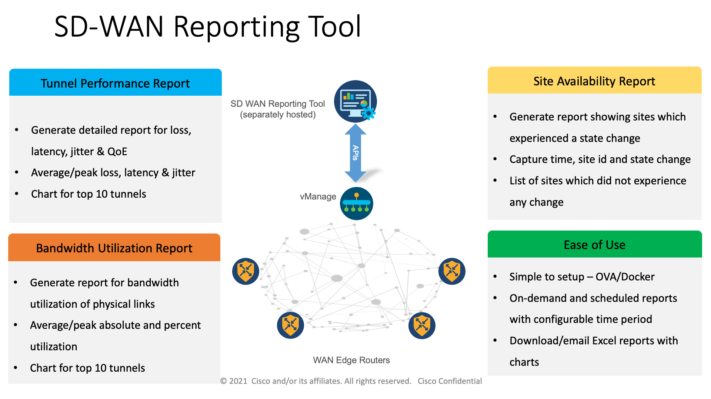

# SD-WAN-Reporting-Tool
This is a simple Reporting Tool that leverages vManage APIs to retrieve data and generate reports. The tool is available as an OVA and as a docker file (see links below). Please refer to the Guide (on this github) for further details.

This guide is indended to be used for reference while using the Cisco SD-WAN Reporting Utiliy. The guide can be accessed [HERE](https://github.com/CiscoDevNet/SD-WAN-Reporting-Tool/blob/main/Cisco-SDWAN-Reporting%20Tool%20Guide.pdf)

File downloads

Docker file: [Cisco SD-WAN Reporting Docker](https://developer.cisco.com/fileMedia/download/568cb4f0-2ffb-32a8-a59f-d0f6f7759cda/)

OVA file: [Cisco SD-WAN Reporting OVA](https://developer.cisco.com/fileMedia/download/7553c06b-9e09-35b0-b4a1-bcc4b181336d)

The Cisco SD-WAN Reporting Utiliy can be used in the [Cisco DevNet Reservable Sandbox for SD-WAN](https://devnetsandbox.cisco.com/RM/Diagram/Index/c9679e49-6751-4f43-9bb4-9d7ee162b069?diagramType=Topology) fabric or the [Cisco DevNet Always On Sandbox for SD-WAN](https://devnetsandbox.cisco.com/RM/Diagram/Index/fa7f7ef9-e224-4ee7-a3fe-0f25506e9db9?) for testing purposes.

*Note: This tool only supports single-tenant vManage deployments.
